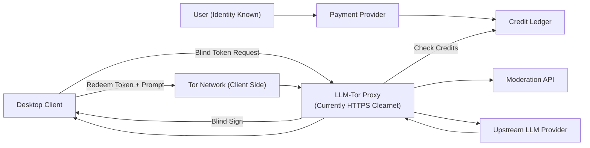
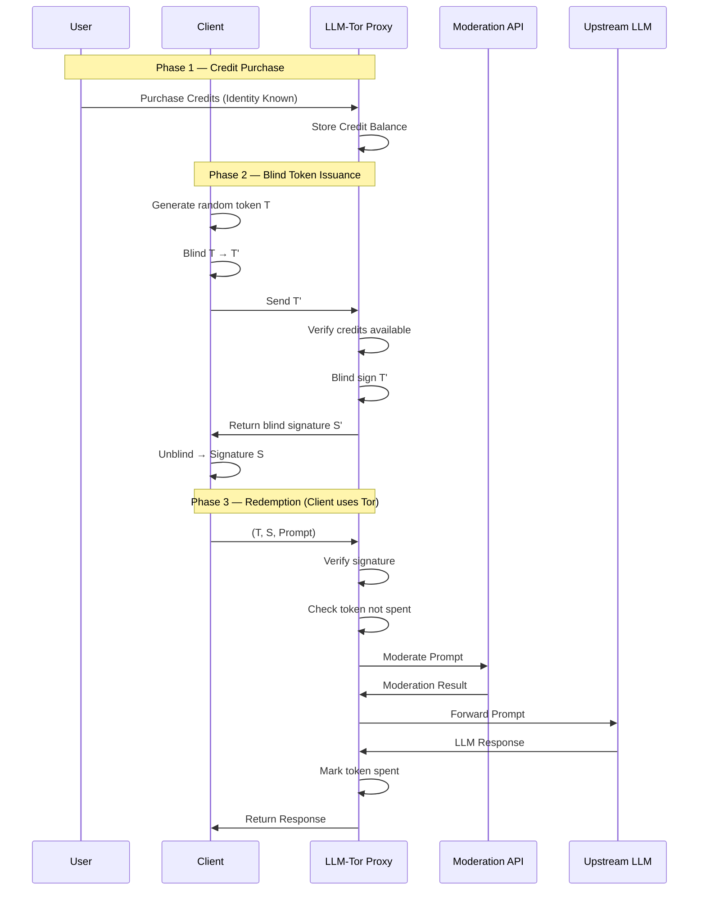
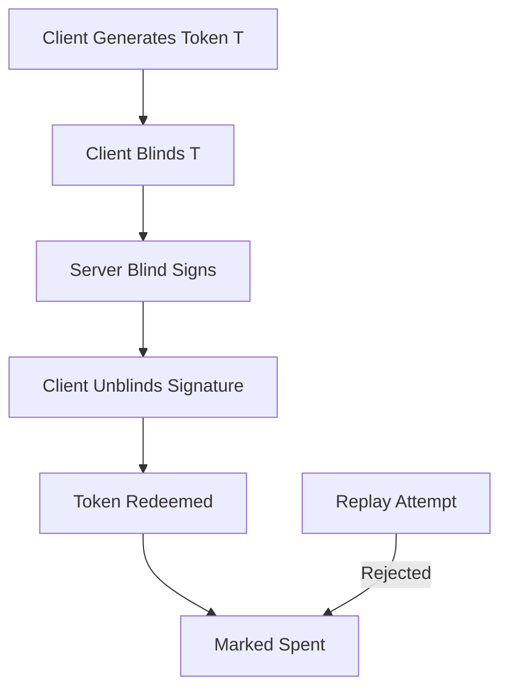
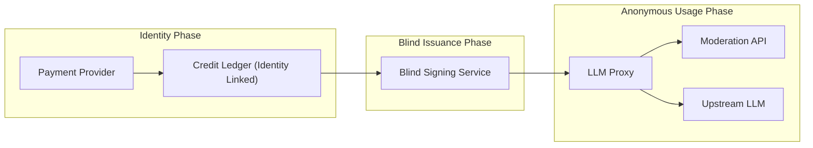

# LLM-Tor

LLM-Tor is a privacy-preserving proxy layer for public LLM APIs.

It cryptographically separates payment identity from model usage using blind signatures and Tor routing so that even
LLM-Tor cannot link identity between users and their chat content.

## Why?

Public LLM APIs link prompts to user accounts.

LLM-Tor breaks this linkage.

## How It Works

1. User buys credits.
2. Client generates blind tokens.
3. Server blind-signs tokens.
4. Client redeems tokens over Tor.
5. Server verifies signature and forwards to LLM.

The server cannot link usage to identity.

Note:
The LLM inference proxy currently operates over standard HTTPS. But the desktop client accesses
it via tor exit node only. Onion only deployment is planned.

## Security Properties

- Blind RSA unlinkability
- Single-use tokens
- Tor-based anonymity
- No chat persistence

## Threat Model

Protects against:
- Proxy linking identity to prompt

Does not protect against:
- Upstream LLM provider logging the "content"
- Global network adversary

## Whitepaper

See whitepaper.pdf at the root of the repo.

## Architecture

### High-Level Architecture

## End-to-End Protocol Flow

### Token Lifecycle

### Trust boundaries

## License

See LICENSE file in this directory.
For desktop-client, a separate license is present in its directory.

## Public Keys For Clients
Technically any custom client can interact with the LLMTor backend. The public keys used by the models are present at:
`desktop-client/src/types/config.ts`

